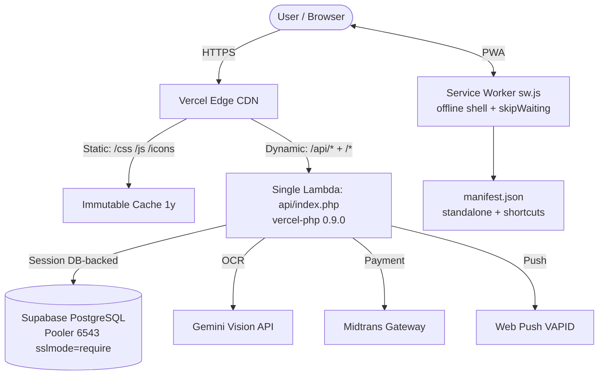

# SelarasKas — Personal Finance PWA

<p align="center">
  <a href="https://selaras-kas.vercel.app"></a>
  
  
  
  
</p>

<p align="center">
  <b>Kelola pemasukan, pengeluaran & target tabungan — ringan, elegan, installable di HP tanpa Play Store.</b><br/>
  <sub>PWA · Offline shell · Supabase Pooler · Gemini Vision OCR · Web Push · Midtrans</sub>
</p>

> **Live Production:** [https://selaras-kas.vercel.app](https://selaras-kas.vercel.app)  
> **Stack Focus:** PHP 8.3 (vanilla, no framework) · Vanilla JS modular · Supabase PostgreSQL · Vercel Serverless  
> **Author:** Rizky Dwi — [github.com/rizdwi](https://github.com/rizdwi)

---

## Ringkasan Eksekutif

Aplikasi pencatat keuangan pribadi sering gagal karena **terlalu berat, butuh install native, atau tidak bisa offline**. SelarasKas menyelesaikan ini sebagai **Progressive Web App (PWA)** yang:

- **Installable** — Add to Home Screen, tampil seperti aplikasi native (standalone, portrait, splash).
- **Ringan** — tanpa framework JS berat; 18 modul `js/` vanilla yang lazy-loaded via `defer`.
- **Tahan serverless** — Single-Lambda `vercel-php` + Supabase Pooler (port 6543) agar koneksi DB tidak bocor di environment ephemeral Vercel.
- **Pintar** — scan struk belanja pakai **Gemini Vision OCR**, notifikasi push, gamifikasi, dan analitik cashflow.

---

## Arsitektur



**Keputusan teknis yang tidak terlihat di demo:**

| Masalah Serverless | Solusi |
| :--- | :--- |
| `vercel.json` `rewrites` bikin `index.php` ter-download sebagai `application/x-httpd-php` | Pakai `routes` (bukan `rewrites`) — paksa eksekusi via `api/index.php` |
| Koneksi DB bocor di function ephemeral | **Supabase Pooler** (`aws-0-ap-southeast-1.pooler.supabase.com:6543`) + `session_set_save_handler` DB-backed |
| Cold start berat | PHP vanilla tanpa framework — boot < 50ms |

---

## Fitur Utama

| Kategori | Fitur |
| :--- | :--- |
| **Transaksi** | Pemasukan / pengeluaran, kategori custom, filter bulan, swipe-to-delete, pull-to-refresh |
| **Dompet** | Multi-wallet, switcher global, anggota wallet |
| **Budgeting** | Anggaran per kategori & bulan, navigasi bulan, progress ring |
| **Tabungan** | Target tabungan (12 ikon + 8 warna), setor progres, tracking |
| **Analitik** | Ringkasan bulanan, chart kategori, weekly, cashflow, comparison & trends (Chart.js), export **PNG & PDF** |
| **OCR Struk** | Foto struk → Gemini Vision → auto-parse nominal & kategori (`api/ocr.php`, `js/camera.js`) |
| **Gamifikasi** | Poin & badge (`add_income +10`, `add_saving +20`, `daily_login +5`) |
| **Notifikasi** | Web Push via VAPID (`push.php` + `push_worker.php`), in-app notifications |
| **Auth** | Email + OTP verifikasi, Google OAuth (GSI), Facebook, **WebAuthn / Biometric**, remember token, CSRF guard |
| **PWA** | `manifest.json` (shortcuts, screenshots, maskable icons), `sw.js` offline shell, iOS `apple-touch-icon` |
| **Lainnya** | AI Chat (`ai_chat.php`), backup DB, subscription/Midtrans, admin panel (`admin.html`) |

---

## Tech Stack

| Layer | Detail |
| :--- | :--- |
| **Frontend** | HTML partials (`partials/`), CSS 8-file system (`variables`, `base`, `layout`, `components`, `pages`, `responsive`, `utilities`, `modern-ui`), Vanilla JS 18 modul (`defer` loaded) |
| **Backend** | PHP 8.3 vanilla, 19 endpoint di `api/` (PDO, prepared statements, auto-migrate `CREATE TABLE IF NOT EXISTS`) |
| **Database** | Supabase PostgreSQL via **Pooler** (6543, `sslmode=require`), fallback MySQL |
| **PWA** | `manifest.json` v100-mono, `sw.js` (Cache `selaraskas-v100-mono`, `skipWaiting`), system fonts (tanpa Google Fonts) |
| **AI & Integrasi** | Gemini Vision (OCR), Resend (email), Midtrans (payment), Google GSI, Chart.js, Web Push (VAPID) |
| **Deploy** | Vercel — `vercel-php@0.9.0` Single-Lambda, `routes` (bukan `rewrites`), header cache immutable untuk assets |

---

## Struktur Proyek

```
SelarasKas/
├── api/                  # 19 endpoint PHP (auth, transactions, ocr, push, ...)
│   ├── config.php        # DB pooler + session handler + env
│   ├── index.php         # Unified serverless entrypoint
│   └── ocr.php           # Gemini Vision proxy (20M body, 256M memory)
├── js/                   # 18 modul vanilla (api, auth, analytics, camera, ...)
├── css/                  # 8 file (variables → modern-ui)
├── partials/             # head, auth, app_layout, modals, scripts
├── icons/                # PWA icons 192 & 512 (any + maskable)
├── index.php             # Shell (include partials)
├── manifest.json         # PWA manifest
├── sw.js                 # Service Worker
├── vercel.json           # routes (Single-Lambda)
└── index.css             # @import aggregator
```

---

## Quick Start (Lokal)

```bash
# 1. Clone
git clone https://github.com/rizdwi/SelarasKas.git
cd SelarasKas

# 2. Jalankan dengan PHP built-in (tanpa Vercel)
php -S localhost:8000

# 3. Buka http://localhost:8000
# Untuk fitur DB, set env di api/.env.local.php atau export:
# DB_HOST, DB_PORT, DB_NAME, DB_USER, DB_PASS, GEMINI_API_KEY, etc.
```

**Deploy ke Vercel:** push ke `main` — Vercel auto-build via `vercel-php@0.9.0`. Pastikan env `DB_HOST` menunjuk ke **Pooler** Supabase (bukan direct DB host).

---

## PWA — Install di HP

1. Buka [selaras-kas.vercel.app](https://selaras-kas.vercel.app) di Chrome/Safari HP
2. Tap **⋮ → Add to Home Screen** (Android) atau **Share → Add to Home Screen** (iOS)
3. Aplikasi akan muncul seperti native — tanpa Play Store, bisa offline

Shortcuts: **Tambah Pemasukan** & **Tambah Pengeluaran** langsung dari long-press icon.

---

## Keamanan

- CSRF token untuk `POST/PUT/DELETE` (`X-CSRF-Token`)
- `requireAuth()` + `requireActiveWallet()` guard di setiap endpoint sensitif
- Password `password_hash` + OTP expiry + WebAuthn SHA-256
- Tanpa `INTERNET` permission berlebih — PWA hanya fetch ke origin sendiri + Gemini/Midtrans

---

## Author

**Rizky Dwi** — Software Engineer (PHP · PWA · Supabase · Flutter)

- GitHub: [@rizdwi](https://github.com/rizdwi)
- Prinsip: **lightweight · robust · zero tolerance for errors**

> Jika kamu menghargai **ringan tapi tahan banting di produksi**, kita akan cocok berkolaborasi.

---

<p align="center">
  <sub>© 2026 Rizky Dwi — SelarasKas · PWA · Supabase Pooler · Vercel Serverless</sub>
</p>
